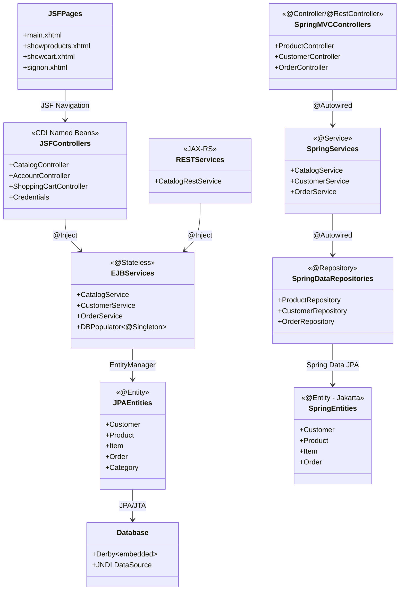

# Repository Recon & Modernisation Brief

**Project**: Java EE 6 Petstore Application  
**Assessment Date**: November 3, 2025  
**Target**: Spring Boot 3 Migration (Java 17+)  
**Repository**: agoncal-application-petstore-ee6  

## 1. Inventory

### Project Modules & Structure
- **Packaging**: WAR (Web Application Archive) - single module Maven project
- **Java Version**: 1.6 (extremely legacy)
- **Build Tool**: Maven 3.x with multiple profiles for different app servers
- **Final Build**: `applicationPetstore.war`

### Framework Versions
- **Java EE**: 6.0 (provided by container)
- **JSF**: 2.0 (Facelets-based UI)
- **EJB**: 3.1 Lite (CDI-enabled session beans)
- **JPA**: 2.0 (using `javax.persistence.*`)
- **CDI**: 1.0 (`javax.enterprise.*` and `javax.inject.*`)
- **Bean Validation**: 1.0 (`javax.validation.*`)
- **JAX-RS**: 1.1 (`javax.ws.rs.*`)

### Application Server Dependencies
- **Primary**: GlassFish 3.1.2 (embedded all profile)
- **Secondary**: JBoss AS 7.x, TomEE 1.x
- **JPA Providers**: EclipseLink (primary), Hibernate, OpenJPA
- **Database**: Derby embedded (in-memory for testing)

### Persistence Setup
- **JPA Unit**: `applicationPetstorePU`
- **Data Source**: JNDI lookup `java:global/jdbc/applicationPetstoreDS` 
- **Configuration**: `src/main/resources/META-INF/persistence.xml`
- **Transaction Type**: JTA (container-managed)
- **DDL Generation**: `drop-and-create-tables` for development

### UI Technologies
- **Frontend**: JSF 2.0 Facelets (`.xhtml` templates)
- **Template**: `src/main/webapp/WEB-INF/layouts/template.xhtml`
- **Navigation**: JSF implicit navigation with `.faces` suffix
- **Styling**: Twitter Bootstrap 2.3.2, jQuery 1.9.1 (via WebJars)
- **Pages**: 11 XHTML pages including main, account, catalog, cart flows

## 2. Risk Heatmap

### High-Risk `javax.*` Dependencies

#### EJB Layer (`javax.ejb.*`)
- **Files**: `CatalogService.java`, `CustomerService.java`, `OrderService.java`, `DBPopulator.java`
- **Annotations**: `@Stateless` (3 instances), `@Singleton` (1 instance)
- **Risk Level**: 🔥🔥🔥 **HIGH** - Complete replacement needed with Spring `@Service` + `@Transactional`

#### JSF/Faces (`javax.faces.*`)
- **Files**: All controllers in `web/` package, `ExceptionInterceptor.java`
- **Usages**: `FacesContext`, `FacesMessage`, `FacesServlet` configuration
- **Risk Level**: 🔥🔥🔥 **HIGH** - JSF → Spring MVC + Thymeleaf/REST migration required

#### JPA (`javax.persistence.*`) 
- **Files**: All domain entities, `DatabaseProducer.java`
- **Annotations**: `@Entity`, `@PersistenceContext`, `@NamedQuery`, lifecycle callbacks
- **Risk Level**: 🔥🔥 **MEDIUM** - Migrate to `jakarta.persistence.*` + Spring Data JPA

#### CDI/Injection (`javax.enterprise.*`, `javax.inject.*`)
- **Files**: All web controllers, service producers, interceptors  
- **Annotations**: `@Named`, `@RequestScoped`, `@SessionScoped`, `@Inject`, `@Produces`
- **Risk Level**: 🔥🔥 **MEDIUM** - Replace with Spring DI (`@Component`, `@Autowired`)

#### JAX-RS (`javax.ws.rs.*`)
- **Files**: `CatalogRestService.java`
- **Annotations**: `@Path`, `@GET`, `@POST`, `@PUT`, `@DELETE`, `@Produces`, `@Consumes`
- **Risk Level**: 🔥 **LOW** - Direct Spring Boot REST controller migration

### XML Configuration Hotspots
- **`web.xml`**: Servlet 3.0 → Spring Boot embedded server
- **`faces-config.xml`**: JSF configuration → Remove (Spring MVC)
- **`persistence.xml`**: JPA configuration → `application.properties`
- **`beans.xml`**: CDI configuration → Remove (Spring context)

### Container Dependencies
- **JNDI Lookups**: `@PersistenceContext` → Spring Boot DataSource auto-config
- **JTA Transactions**: Container-managed → Spring `@Transactional`
- **Application Server**: GlassFish/JBoss deployment → Standalone JAR

## 3. Dependency Diagram (Mermaid)



## 4. Behaviour Summary

### Key Functional Flows

#### 1. Catalog Browsing
- **JSF Pages**: `main.xhtml` → `showproducts.xhtml` → `showitems.xhtml` → `showitem.xhtml`
- **Controller**: `CatalogController.doFindProducts()`, `doFindItems()`, `doFindItem()`  
- **Service**: `CatalogService.findProducts()`, `findItems()`, `findItem()`
- **Entities**: `Category` → `Product` → `Item` (hierarchical navigation)
- **Target REST**: `GET /api/categories/{name}/products`, `GET /api/products/{id}/items`

#### 2. Customer Registration/Authentication
- **JSF Pages**: `signon.xhtml` → `createaccount.xhtml` → `showaccount.xhtml`
- **Controller**: `AccountController.doSignin()`, `doCreateAccount()`
- **Service**: `CustomerService.createCustomer()`, `findCustomer()`
- **Security**: `SimpleLoginModule` (JAAS) → Spring Security
- **Target**: REST authentication + JWT tokens

#### 3. Shopping Cart & Checkout
- **JSF Pages**: `showcart.xhtml` → `confirmorder.xhtml` → `orderconfirmed.xhtml`
- **Controller**: `ShoppingCartController` (@ConversationScoped)
- **Service**: `OrderService.createOrder()`
- **Entities**: `CartItem` → `Order` → `OrderLine`
- **Target**: Stateless REST cart management

#### 4. Search Functionality
- **Flow**: Keyword search across items/products
- **Method**: `CatalogController.doSearch()` → `CatalogService.searchItems()`
- **Page**: `searchresult.xhtml`
- **Target**: `GET /api/search?q={keyword}`

### Database Schema
- **Tables**: Customer, Address (embedded), Category, Product, Item, Order, OrderLine, CreditCard
- **Relationships**: Category 1→N Product 1→N Item, Customer 1→N Order 1→N OrderLine
- **Named Queries**: 12 custom JPQL queries for business operations

## 5. Recommended Sequencing

| Phase | Goal | Inputs | Outputs | Risk Level |
|-------|------|---------|---------|------------|
| **Phase 1** | **Infrastructure Setup** | Legacy pom.xml, web.xml | Spring Boot parent, application.properties | 🟢 **LOW** |
| | Migrate build system | Java 6 → 17+, Maven profiles | Spring Boot starter dependencies | |
| | Database configuration | persistence.xml, JNDI | Spring DataSource auto-config | |
| **Phase 2** | **Domain Layer Migration** | JPA entities with javax.* | Jakarta Persistence entities | 🟡 **MEDIUM** |
| | Update persistence annotations | @Entity, @NamedQuery | @Entity (Jakarta), Spring Data repos | |
| | Create Spring Data repositories | Manual EntityManager usage | JpaRepository interfaces | |
| **Phase 3** | **Service Layer Migration** | EJB @Stateless services | Spring @Service classes | 🟡 **MEDIUM** |
| | Replace dependency injection | @Inject, @PersistenceContext | @Autowired, constructor injection | |  
| | Transaction management | JTA container transactions | Spring @Transactional | |
| **Phase 4** | **REST API First** | JAX-RS CatalogRestService | Spring @RestController | 🟢 **LOW** |
| | Create modern REST endpoints | XML/JSON JAX-RS responses | Spring Boot JSON/Validation | |
| | API documentation | Manual WADL | OpenAPI 3/Swagger | |
| **Phase 5** | **Frontend Modernization** | JSF Facelets, Controllers | Thymeleaf + REST clients | 🔴 **HIGH** |
| | Replace JSF navigation | Faces implicit navigation | Spring MVC @RequestMapping | |
| | Session management | CDI @SessionScoped | Stateless + JWT tokens | |
| **Phase 6** | **Security & Testing** | JAAS SimpleLoginModule | Spring Security | 🟡 **MEDIUM** |
| | Integration testing | Arquillian + container tests | Spring Boot Test slices | |
| | Deployment strategy | WAR → app server | Self-contained JAR/Docker | |

**Critical Success Factors:**
- Maintain database compatibility throughout migration
- Implement feature flags for parallel UI development  
- Create comprehensive integration test suite before EJB removal
- Plan for zero-downtime deployment strategy

---

## Key Migration Dependencies

### javax.* → Spring/Jakarta Mapping
```
javax.ejb.* → org.springframework.stereotype.Service + @Transactional
javax.faces.* → org.springframework.web.bind.annotation.* + Thymeleaf
javax.persistence.* → jakarta.persistence.* + Spring Data JPA
javax.inject.* → org.springframework.beans.factory.annotation.*
javax.enterprise.context.* → Spring scope annotations
javax.ws.rs.* → org.springframework.web.bind.annotation.*
```

### Configuration Migration
```
web.xml → @SpringBootApplication + @Configuration
persistence.xml → application.properties
faces-config.xml → (removed)
beans.xml → (removed - Spring context)
```

### File Path References
- **Services**: `src/main/java/org/agoncal/application/petstore/service/`
- **Controllers**: `src/main/java/org/agoncal/application/petstore/web/`
- **Entities**: `src/main/java/org/agoncal/application/petstore/domain/`
- **REST**: `src/main/java/org/agoncal/application/petstore/rest/`
- **UI Templates**: `src/main/webapp/**/*.xhtml`
- **Configuration**: `src/main/webapp/WEB-INF/`, `src/main/resources/META-INF/`

---
**Assessment completed**: November 3, 2025  
**Next Step**: Begin Phase 1 Infrastructure Setup